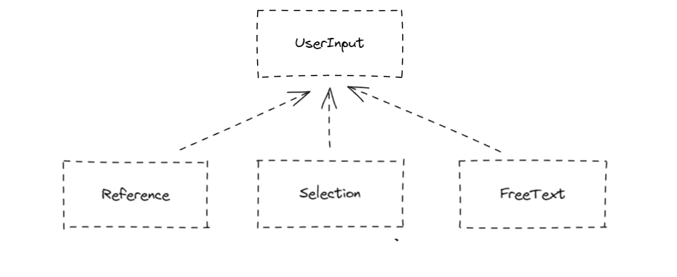

# UserInput PoC

Project created via [start.spring.io](https://start.spring.io/#!type=maven-project&language=java&platformVersion=2.7.3&packaging=jar&jvmVersion=17&groupId=com.bwgjoseph&artifactId=userinput-poc&name=userinput-poc&description=PoC%20for%20various%20UserInput&packageName=com.bwgjoseph.userinput-poc&dependencies=devtools,lombok,configuration-processor,web,data-mongodb)

This project is created to design a flexible model which can cater to 3 types of user inputs, namely

- Selection
  - A dropdown selection field; with a fixed list to choose from
- FreeText
  - A freetext field; could be restricted to numeric, alphabet, or alphanumeric?
- Reference
  - A "pointer" field; contains the id of a referenced document

It could also be a mixture of either. For example,

- The field `Country` can be either a `Selection` or `FreeText` field. If the selection contains what the user can choose from, it will be a `Selection`, otherwise, user can choose `Others` as the input, and type in `FreeText` to represent the field
- The field `User` can be either a `FreeText` or `Reference` field. If the intended user to input is also an existing user in the system, it will be a `Reference`, otherwise, it will simply be a `FreeText`

# Objective

To figure out a way to ensure a strict typing to improve developer experience, and reduce the chance to introduce bug.

There are two integration point we need to look into

- API; how would the model be like?
- Database; how would the model be like?

And how can the model provide a better experience to the developers?

# Questions

Some questions to ask / figure out

- Must we force the client to provide the `input type` (i.e FreeText/Selection/Reference)? Is it possible to infer based on the input?

# Implementation

Current Hierarchy is defined as such

This is based on `name` strategy to cast to the respective classes. While this works, but there is still no differentiation between `Selection` and `FreeText` class given that there is no validation (at the moment).

If we trust the input from the client, client could have passed a `Selection` field value as a `FreeText` type and server would not know. How can we validate this to ensure otherwise? Or do we need to?

For example, given the class is `Address`, we know that it contains `FieldX` and `FieldY`. And each field should have a fixed of value that we expected. In this case, is it possible to check the input from client against this list to ensure what we are receiving is valid? Even if that is possible, do we want to do so? Is it too strict? How should the list be stored? Database or static list?

# Reference

- [jackson-deduction-based-polymorphism](https://www.baeldung.com/jackson-deduction-based-polymorphism)