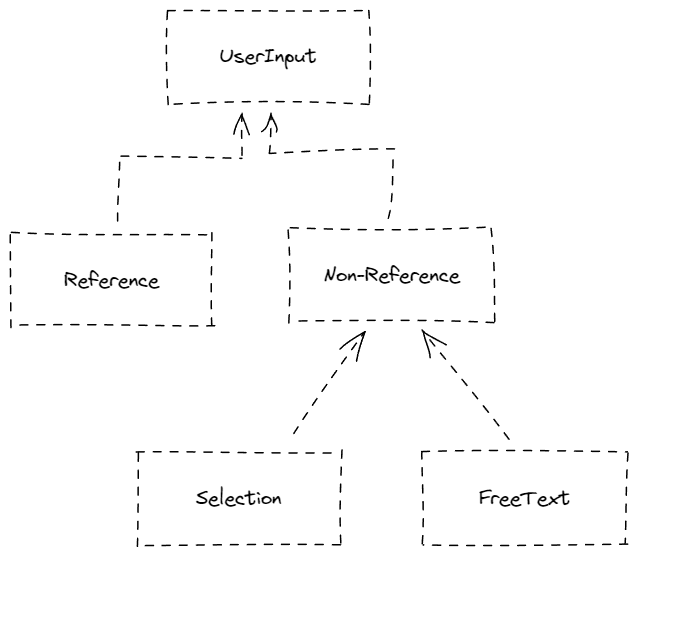

# UserInput PoC

Project created via [start.spring.io](https://start.spring.io/#!type=maven-project&language=java&platformVersion=2.7.3&packaging=jar&jvmVersion=17&groupId=com.bwgjoseph&artifactId=userinput-poc&name=userinput-poc&description=PoC%20for%20various%20UserInput&packageName=com.bwgjoseph.userinput-poc&dependencies=devtools,lombok,configuration-processor,web,data-mongodb)

This project is created to design a flexible model which can cater to 3 types of user inputs, namely

- Selection
  - A dropdown selection field; with a fixed list to choose from
- FreeText
  - A freetext field; could be restricted to numeric, alphabet, or alphanumeric?
- Reference
  - A "pointer" field; contains the id of a referenced document

It could also be a mixture of either. For example,

- The field `Country` can be either a `Selection` or `FreeText` field. If the selection contains what the user can choose from, it will be a `Selection`, otherwise, user can choose `Others` as the input, and type in `FreeText` to represent the field
- The field `User` can be either a `FreeText` or `Reference` field. If the intended user to input is also an existing user in the system, it will be a `Reference`, otherwise, it will simply be a `FreeText`

# Objective

To figure out a way to ensure a strict typing to improve developer experience, and reduce the chance to introduce bug.

There are two integration point we need to look into

- API; how would the model be like?
- Database; how would the model be like?

And how can the model provide a better experience to the developers?

# Questions

Some questions to ask / figure out

- Must we force the client to provide the `input type` (i.e FreeText/Selection/Reference)? Is it possible to infer based on the input?

# Implementation

Current Hierarchy is defined as such

Works:

- Able to serialize / deserialize based on `Jackson Deduction-based polymorphism`

Don't Work:

- If the object is a `subclass` and within a `Box` object such as `Address` then it don't work at the moment (see `shouldCastToSelectionClass_givenBoxedReferenceClass`)

While I use `Deduction` for `@JsonTypeInfo`, which may be suited for `Reference` and `Non-Reference` based class, any `subclass` of `Non-Reference` may need to use a different strategy such as `Name` as it might make more sense. Not sure if a mixture of strategy will work, but need to test it out. Alternatively, should just use `Name` strategy upfront for all classes

# Reference

- [jackson-deduction-based-polymorphism](https://www.baeldung.com/jackson-deduction-based-polymorphism)